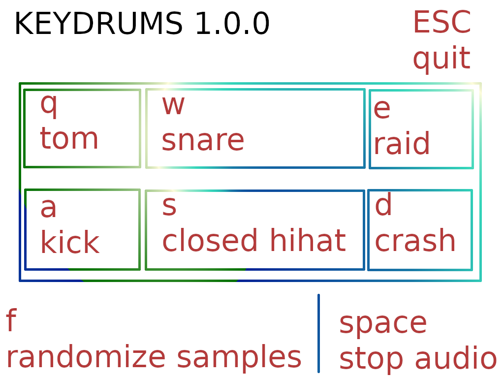

# keydrums

Play drums with the `qweasd` keys, randomze the kit with `f` and stop the sound with `space`.

Keybindings:

* Uses SDL2.
* Tested on Arch Linux.
* Build with `make` or with [`cxx`](https://github.com/xyproto/cxx).
* Version: 1.0.0.
* License: MIT
